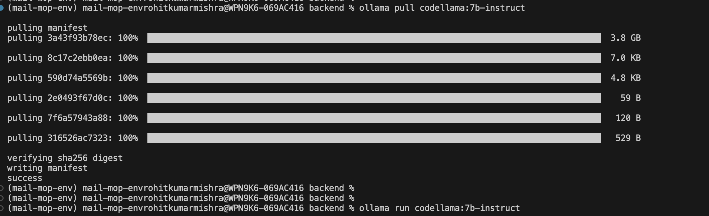
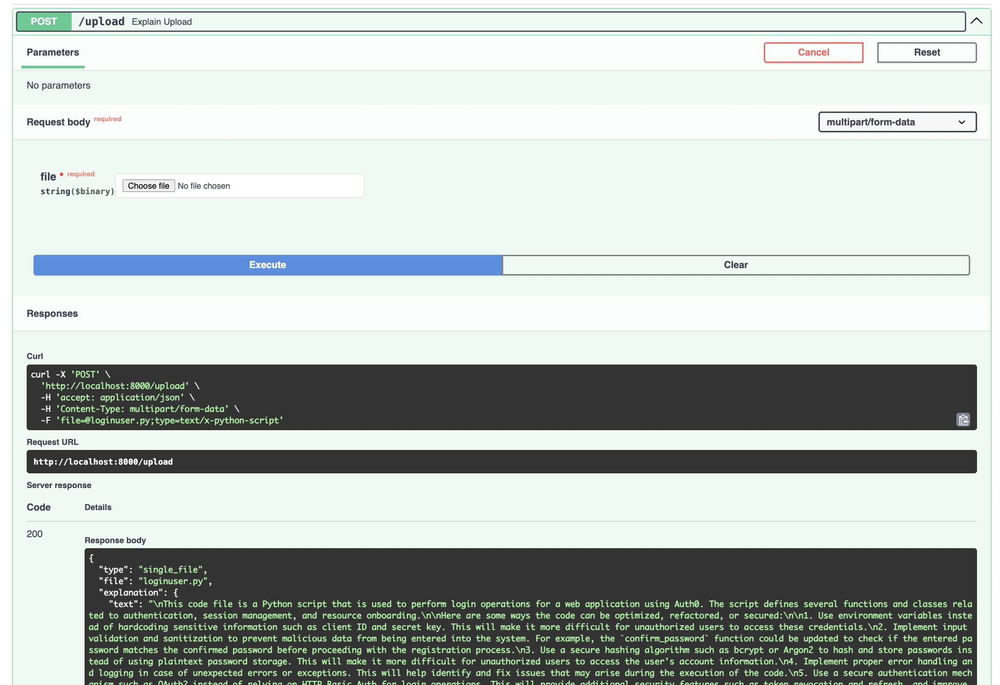
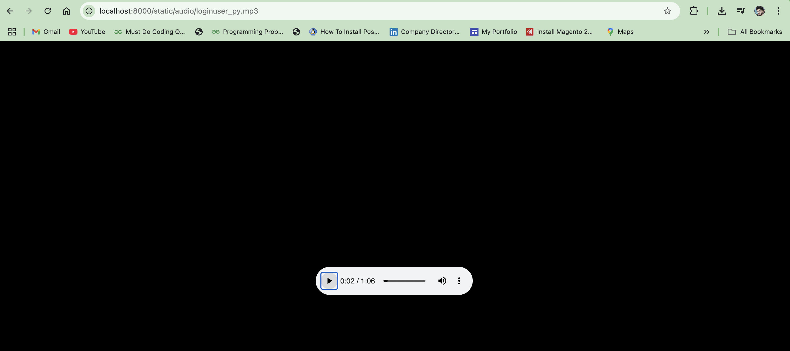

# 🧠 AI Code Explainer

A FastAPI-powered backend that uses local LLMs via [Ollama](https://ollama.com) to intelligently explain your code. Upload any `.py`, `.js`, `.ts`, `.html`, `.json`, `.txt`, or even a `.zip` file of your project — and get an instant explanation with audio narration using Google Text-to-Speech (`gTTS`).

---

## 🚀 Features

- 📂 Upload single files or `.zip` folders
- 🔍 Get detailed explanations of code functionality
- 💡 Includes optimization and improvement suggestions
- 🔊 Auto-generates MP3 voice narration of explanation
- ⚡ Built with FastAPI + Ollama + gTTS
- 🧠 Local LLM-powered: No API keys required!

---

## 📦 Installation & Setup

### 1. Clone the Repository

```
git clone https://github.com/rohitmishr/ai-code-explainer.git
cd ai-code-explainer

```
### 2. Set Up a Python Virtual Environment

```
python -m venv venv
source venv/bin/activate     # For Windows: venv\Scripts\activate
```
### 3. Install Python Dependencies

- pip install -r requirements.txt

- requirements.txt:

```
fastapi
uvicorn
requests
python-multipart
gTTS
```

### 4. Install Ollama (for LLM support)

- Visit: https://ollama.com/download

- After installation:
- ollama pull codellama:7b-instruct
- ollama serve
- ⚠️ Keep this terminal running. Ollama serves the LLM on http://localhost:11434.



### 5. Run the FastAPI Server
```
In a new terminal:


python3 run.py
Visit the interactive Swagger UI:


http://localhost:8000/docs

```
## 🗂 Project Structure
```
.
├── main.py                 # FastAPI API routes
├── app
│   ├── app.py              # FastAPI app setup & CORS
│   └── explain_utils.py    # Core logic for file processing + LLM + gTTS
├── static/audio/           # Auto-generated MP3 explanations
├── requirements.txt
└── README.md
```
### 🧪 Usage

- ▶ Upload a file
- Navigate to /docs

- Use the /upload endpoint

- Upload a .py, .js, or .zip file

```
You’ll receive:

{
  "file": "loginuser.py",
  "explanation": {
    "text": "This module handles login and auth...",
    "audio_url": "/static/audio/loginuser_py.mp3"
  }
}

```


## ▶ Listen to the explanation

```
Go to:
http://localhost:8000/static/audio/loginuser_py.mp3
(Replace loginuser_py.mp3 with your actual filename.)
```



## 🔍 How It Works

- User uploads a file or .zip

- File content is extracted and read

- Sent to local Ollama LLM (codellama:7b-instruct) with a custom prompt

- AI returns a plain-English explanation + suggestions

- gTTS generates an .mp3 from the explanation

- FastAPI serves both text and audio response

## 🛠 Technologies Used
```
FastAPI – high-performance API framework

Ollama + CodeLlama – self-hosted large language model

gTTS – Google Text-to-Speech

Python – main backend language

Uvicorn – ASGI server
```
## 📌 Future Enhancements

- Frontend using Streamlit or React

- PDF/Markdown exports of explanations

- GitHub repo link support

- Syntax-highlighted explanation view

## 👨‍💻 Author

### Rohit Kumar Mishra

- 📧 Email: rohityahoo593@gmail.com

- 🌐 Portfolio [https://sites.google.com/view/rohitkumarmishra/home]

- 💻 GitHub [https://github.com/rohitmishr/]

- 💼 LinkedIn [https://www.linkedin.com/in/rohit-kumar-mishra-16728a1a1/]

### 📄 License

N/A — use it, improve it, and share it!


---


